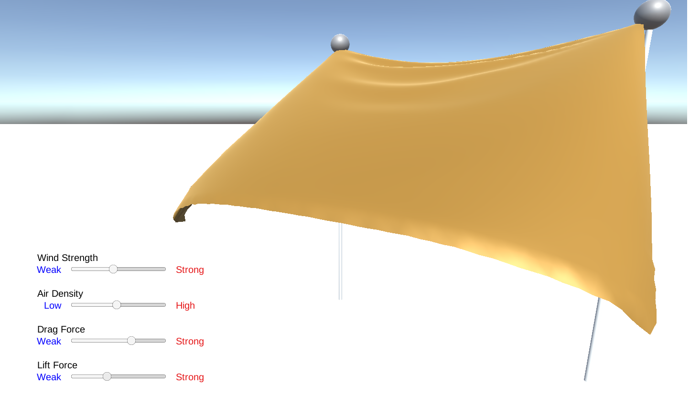

# 発展課題 A2: 弾性体シミュレーション

弾性体シミュレーションに関するデモを 2 つ作成した。2D と 3D それぞれで PBD の実装を行った。

## 2D の PBD

2D については、配布されたサンプルコードに対し距離制約の投影の実装を埋めることで実装した。また元々は箱と鎖のみだったが、新たに二重振り子を追加した。二重振り子が面白い動きをするのは知っていたが、距離制約に基づく比較的簡単な実装によりその動きをシミュレーションすることができてよかった。
Glitch の URL を以下に掲示する。
https://elastic-body-simulation-rn86222.glitch.me/

## 3D の PBD

Unity 上で(C#により)風になびく布を実装した。本レポジトリはその Unity のプロジェクトのレポジトリになっており、コードは`./Assets/Scripts/`に存在する。布は、四角形のメッシュ(厳密には三角形のメッシュ x2)を 64x64 個並べ、各頂点に粒子を置き、距離制約を課すことで表現した。風の表現は、[この論文](https://dl.acm.org/doi/10.1145/2614106.2614120)と、[このレポジトリ](https://github.com/yuki-koyama/elasty)(主に[このコード](https://github.com/yuki-koyama/elasty/blob/b959790659968d3793f78c882bb39619c81886ce/src/cloth-sim-object.cpp))を参考にして実装した。

工夫点としては、インタラクティブな動作として、風の強さ、空気密度, Drag、Lift をスライダーによって変更できるようにしたところである。これらはそれぞれ、[この論文](https://dl.acm.org/doi/10.1145/2614106.2614120)中の式における $v, \rho, C_D, C_L$ に対応する。
動作の確認は Windows 11, Unity 2022.3.8.f1 で行っている。このレポジトリをクローンし同じバージョンの Unity で開くことで動作確認ができるはずである。だが、何かしらの問題でできなかった場合に備え、本プロジェクトを WebGL 向けにビルドし、GitHub Pages でデプロイ・公開した。URL を以下に掲示する。
https://rn86222.github.io/Cloth/
なお原因不明だが、上の URL にアクセスした後、例えば他のページを数秒間閲覧したのち元のページに戻ると、布が予想外の挙動をして飛んで行ってしまうことがあった(リロードすると戻る)。ただ、Unity 上でシミュレーションを行う場合や、上の URL を開いて他のページに移動することなく操作している限りはそのようなことは起こらなかったので、この現象は今回の実装上の問題ではないと判断した(WebGL へのビルドの際のバグ？)。
